# ☁️ MiniDrive — 개인용 클라우드 파일 관리 서비스

<p align="center">
  
  
  
  
</p>

<p align="center">
  Flask + React + MySQL 기반 개인용 클라우드 드라이브<br/>
  파일 업로드 · 폴더 관리 · 공유 링크 생성 등 실용적인 파일 관리 기능을 제공합니다.
</p>

---

## 📌 프로젝트 개요

Flask, React, MySQL을 기반으로 개인용 클라우드 드라이브 서비스를 풀스택으로 구현한 프로젝트입니다.

JWT 인증 기반 사용자 시스템으로 안전한 접근 제어를 구현하였으며, 드래그앤드롭 업로드, 폴더 생성 · 이동, 미리보기, 검색, 중복 파일 탐지, 자동 분류, 휴지통 등 실용적인 파일 관리 기능과 공유 링크 생성 · 만료 시간 설정 · 다운로드 횟수 추적 기능을 포함하여 실제 클라우드 서비스와 유사한 사용 경험을 제공합니다.

---

## ⚙️ 주요 기능

| 기능 | 설명 |
|------|------|
| **회원가입 / 로그인** | JWT 인증 기반 사용자 시스템, 토큰 만료 24시간 |
| **파일 업로드** | 드래그앤드롭 · 우클릭 업로드, 업로드 중 상태 표시 |
| **파일 관리** | 다운로드 · 삭제 · 이름 변경 · 폴더 간 이동 |
| **파일 미리보기** | 이미지(png, jpg, gif, webp, svg) 및 PDF 미리보기 |
| **파일 검색** | 파일명 키워드 기반 실시간 검색 |
| **폴더 관리** | 폴더 생성 · 이동 · 삭제, 파일 트리 구조 탐색 |
| **중복 파일 탐지** | 동일 파일 업로드 시 SHA256 해시 기반 중복 감지 |
| **자동 분류** | 확장자 기준 자동 분류 규칙 설정 |
| **예약 업로드** | 지정한 시간 후 파일이 드라이브에 공개 |
| **휴지통** | 삭제된 파일 휴지통 보관 및 복원 기능 |
| **공유 링크** | 파일별 공유 토큰 생성, 만료 시간 설정(무기한/24시간/7일) |
| **다운로드 추적** | 공유 링크 다운로드 횟수 자동 카운트 |
| **저장 용량 관리** | 사용자별 용량 한도 설정 및 실시간 사용량 시각화 |
| **Breadcrumb** | 현재 폴더 경로 표시 및 상위 폴더 클릭 이동 |
| **우클릭 메뉴** | Google Drive 스타일 컨텍스트 메뉴 |

---

## 🔄 시스템 구조

```
[React Frontend]  ←→  [Flask REST API]  ←→  [MySQL Database]
   (port 3000)           (port 5000)           (minidrive DB)
                              ↕
                      [로컬 파일 스토리지]
                        (uploads 폴더)
```

### 데이터 흐름
> 사용자 로그인 → JWT 토큰 발급 → API 요청 시 토큰 인증 → DB 조회/저장 → 화면 반영

### 파일 업로드 흐름
> 파일 선택(드래그앤드롭/버튼) → 용량 체크 → UUID 파일명 변환 → 서버 저장 → DB 메타데이터 기록 → 용량 업데이트

### 공유 링크 흐름
> 파일 우클릭 → 공유 링크 생성 → 만료 시간 선택 → 토큰 생성 → 링크 복사 → 비로그인 사용자 다운로드

---

## 🖥️ 소프트웨어 화면

### 로그인 및 회원가입
JWT 인증 기반의 로그인 · 회원가입 화면입니다.

| 로그인 | 회원가입 |
|:---:|:---:|
| 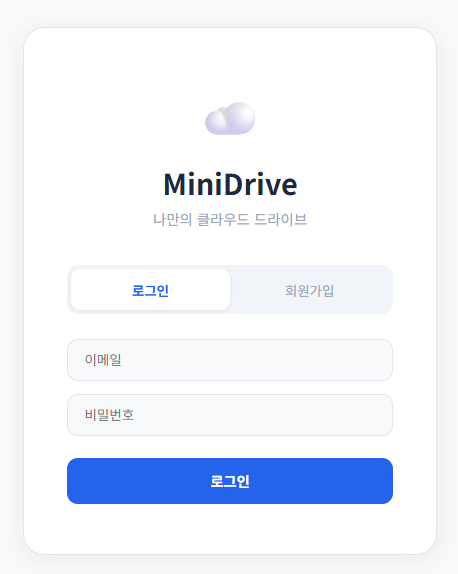 | 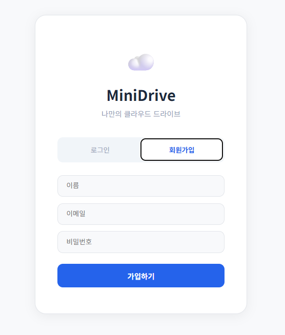 |

### 메인 화면
파일 목록, 폴더 트리, 저장 용량, 검색 등 클라우드 드라이브의 핵심 기능을 한눈에 확인할 수 있습니다.

| 메인 화면 | 우클릭 메뉴 |
|:---:|:---:|
| 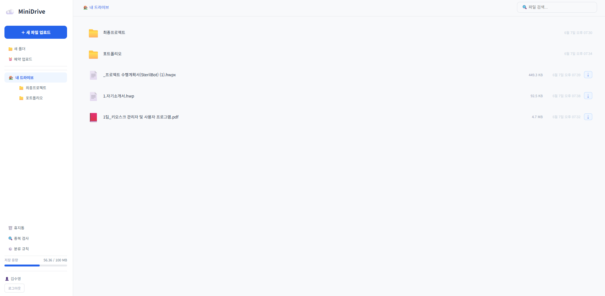 | 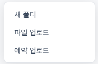 |

### 파일 관리
파일 검색, 미리보기, 다운로드, 폴더 이동 기능을 제공합니다.

| 파일 검색 | 파일 미리보기 |
|:---:|:---:|
| 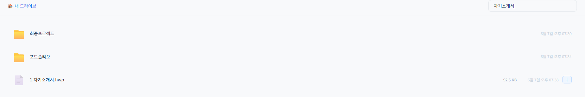 | 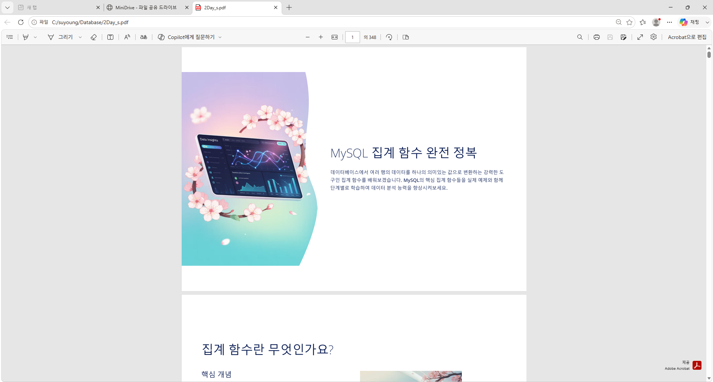 |

| 다운로드 | 폴더 이동 |
|:---:|:---:|
| 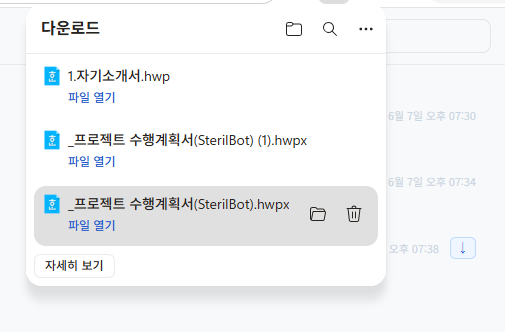 |  |

### 고급 기능
예약 업로드, 중복 파일 감지, 휴지통 기능을 제공합니다.

| 예약 업로드 | 중복 파일 감지 | 휴지통 |
|:---:|:---:|:---:|
|  | 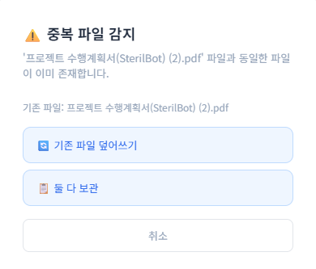 | 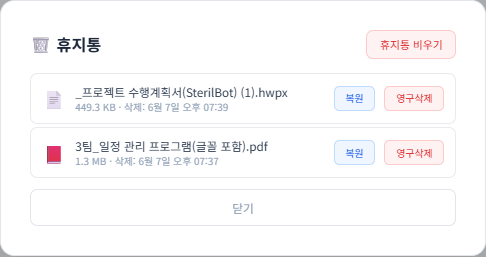 |

### 공유 링크
파일별 공유 토큰 생성 및 만료 시간 설정을 지원합니다.

| 공유 링크 생성 | 링크 복사 |
|:---:|:---:|
| 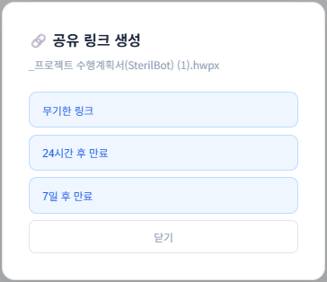 | 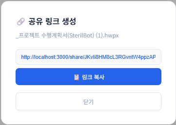 |

---

## 🗄️ DB 구조

```
users (사용자)
├── id, email, password, username
├── storage_used (사용 중인 용량)
└── created_at

folders (폴더)
├── id, name, user_id
├── parent_id → folders(id)  [자기 참조 - 트리 구조]
└── created_at

files (파일)
├── id, original_name, stored_name
├── file_size, mime_type
├── folder_id → folders(id)
├── user_id → users(id)
└── created_at

shares (공유 링크)
├── id, token, file_id → files(id)
├── user_id → users(id)
├── expires_at, download_count
└── created_at
```

---

## 📁 프로젝트 구조

```
MiniDrive/
├── backend/
│   ├── app.py              # Flask 메인 (인증 API)
│   ├── config.py           # 설정 (DB, JWT, 파일 제한)
│   ├── models.py           # DB 테이블 생성
│   ├── auth.py             # JWT 인증 모듈
│   └── routes/
│       ├── file_routes.py  # 파일 API (업로드/다운로드/삭제/이동)
│       ├── folder_routes.py # 폴더 API (생성/삭제/경로 조회)
│       └── share_routes.py # 공유 링크 API
├── frontend/
│   └── src/
│       └── App.jsx         # React 메인 (전체 UI)
└── uploads/                # 파일 저장 디렉토리
```

---

## 🚀 실행 방법

### 1. 사전 준비
- Python 3.x
- Node.js
- MySQL

### 2. 백엔드 실행
```bash
cd backend
pip install flask flask-cors pymysql pyjwt python-dotenv
python app.py
```
> 서버가 `http://localhost:5000` 에서 실행됩니다.

### 3. 프론트엔드 실행
```bash
cd frontend
npm install
npm start
```
> 클라이언트가 `http://localhost:3000` 에서 실행됩니다.

### 4. DB 설정
MySQL에서 `minidrive` 데이터베이스를 생성하면, 서버 시작 시 테이블이 자동으로 생성됩니다.

```sql
CREATE DATABASE minidrive;
```

---

## 🛠️ 기술 스택

- **Backend** : Python, Flask, Flask-CORS, PyJWT
- **Frontend** : React (JSX), JavaScript
- **Database** : MySQL, PyMySQL
- **인증** : JWT (JSON Web Token)
- **파일 저장** : UUID 기반 로컬 파일 스토리지
- **IDE** : Visual Studio Code
- **DB 관리** : MySQL Workbench

---

## 👤 개발자

| 이름 | 역할 |
|------|------|
| **김수영** | **풀스택 개발 (Backend + Frontend + DB 설계)** |
